# ⚖️ Credifi: The Forensic AI Underwriting Engine

---

## 🚩 Problem Statement
In the 2026 financial landscape, AI-driven credit scoring faces three critical "Black Box" challenges that undermine institutional trust and regulatory compliance:

1.  **Audit Vulnerability**: Traditional databases are mutable. A malicious actor can alter a credit decision after the fact, leaving no trace for regulators.
2.  **Explainability Gap**: Complex models (XGBoost, Neural Nets) provide high accuracy but lack a "Reasoning Chain." Applicants are left wondering why they were rejected.
3.  **Algorithmic Bias**: Hidden demographic biases (Gender, Age, Geography) can lead to unintentional systemic discrimination, violating mandates like the **EU AI Act**.
4.  **Actionable Paralysis**: Most scoring engines provide a "No" without telling the applicant how to get to a "Yes."

---

## 💡 The Solution: Credifi
**Credifi** is a next-generation Forensic Underwriting Platform that transforms the "Black Box" into a "Glass Box." It provides a cryptographically secured environment where every decision is:
- **Immutable**: Secured via a tamper-evident blockchain-lite ledger.
- **Explainable**: Deconstructed into human-readable neural contributions.
- **Actionable**: Interactive simulations guide applicants toward financial approval.
- **Accountable**: Real-time regulatory monitoring for institutional fairness.

---

## ✨ Unique Features (The "Credifi Advantage")

| Feature | Technical Impact | USP (Unique Selling Point) |
| :--- | :--- | :--- |
| **🔗 Forensic Hash Chain** | HMAC-SHA256 Chaining | Every decision is cryptographically linked to the previous one. Any manual database edit "breaks" the chain, triggering an immediate anomaly alert. |
| **🧠 Neural "Thinking" Sequence** | XAI Animation Engine | Visualizes the model's internal processing steps (Reading Profile → Scoring Trees → Verifying Integrity), making the AI feel computed and transparent. |
| **🎮 "What-If" Strategy Sandbox** | SHAP Linear Simulation | The flagship feature. Applicants can manipulate their financial profile to see exactly how specific changes (e.g., lower DTI) shift their approval probability in real-time. |
| **📊 Regulatory 4/5ths Cockpit** | Disparate Impact Automation | Automated monitoring of the 4/5ths rule. Provides pass/fail indicators across all protected attributes (Gender, Age, Income) for immediate compliance auditing. |
| **🕵️ AI Forensic Investigator** | Gemini-Flash Analysis | When a breach is detected, a dedicated LLM scans the compromised node, hypothesizes the point of entry, and provides 4-step remediation logic. |

---

## 🏗️ Three-Role Architecture

The system is architected for institutional scale, providing tailored environments for each stakeholder:

### 🟢 1. The Applicant Experience
Focuses on **Transparency & Guidance**. Applicants see their outcome, copy their forensic hash for their own records, and use the "What-If" simulator to map a path to their next loan.

### 🟡 2. The Compliance Engine
Focuses on **Integrity & Forensics**. Compliance officers monitor the live ledger, perform system-wide "Integrity Checks," and use the AI Inspector to investigate cryptographic discrepancies.

### 🔵 3. The Regulatory Dashboard
Focuses on **Fairness & Drift**. Regulators monitor institutional bias (Demographic Parity), track model stability (PSI), and download certified PDF Audit Reports for government submission.

---

## 📐 System Architecture

```mermaid
graph TD
    subgraph "Ingestion & Inference"
        A[👤 Applicant Input] --> B[⚙️ XGBoost Engine]
        B --> C[💡 SHAP Explainability]
    end

    subgraph "Forensic Ledgering"
        C --> D[🔗 Hash Chainer]
        D --> E[🗄️ Tamper-Evident DB]
    end

    subgraph "Institutional Oversight"
        E --> F[🟢 Applicant UI]
        E --> G[🟡 Compliance UI]
        E --> H[🔵 Regulator UI]
    end

    subgraph "Anomaly Detection"
        G --> I[⚡ Integrity Scan]
        I --"Fail"--> J[🕵️ Gemini AI Inspector]
    end
    
    style E fill:#064e3b,stroke:#059669,stroke-width:2px
    style J fill:#450a0a,stroke:#dc2626,stroke-width:2px
```

---

## 🔄 End-to-End Workflow

1.  **Decision Trigger**: An applicant submits a profile. The system computes a score and generates **Neural Contributions**.
2.  **Cryptographic Locking**: The decision is hashed with the previous record's signature, "locking" it into the ledger.
3.  **Real-Time Audit**: The Compliance Officer runs an **Integrity Cycle**. The system re-verifies every hash in the database.
4.  **Forensic Investigation**: If an admin manually changed a value, the hash chain breaks. The officer launches the **Forensic Modal** to see AI-suggested remediation steps.
5.  **Regulatory Export**: At the end of the quarter, the Regulator exports a **PDF Compliance Report** containing the 4/5ths rule pass/fail table and forensic ledger summaries.

---

## 🛠️ Technology Stack

- **Forensic Ledger**: HMAC-SHA256 Sequential Chaining.
- **Model Logic**: XGBoost (Classifier), SHAP (Explanation Engine).
- **Compliance AI**: Google Gemini-Flash (Anomaly Hypothesis).
- **Backend**: FastAPI (Python), SQLAlchemy (WAL-optimized SQLite/Postgres).
- **Frontend**: React 18, Framer Motion (Animations), Recharts, Lucide Icons.

---

*Securing the future of equitable and accountable financial AI.*
